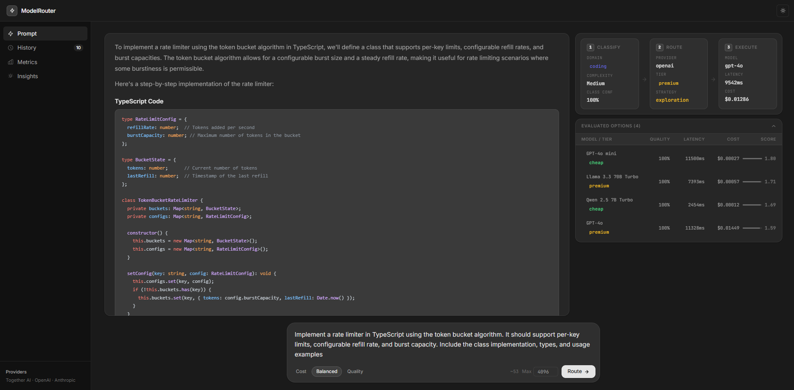
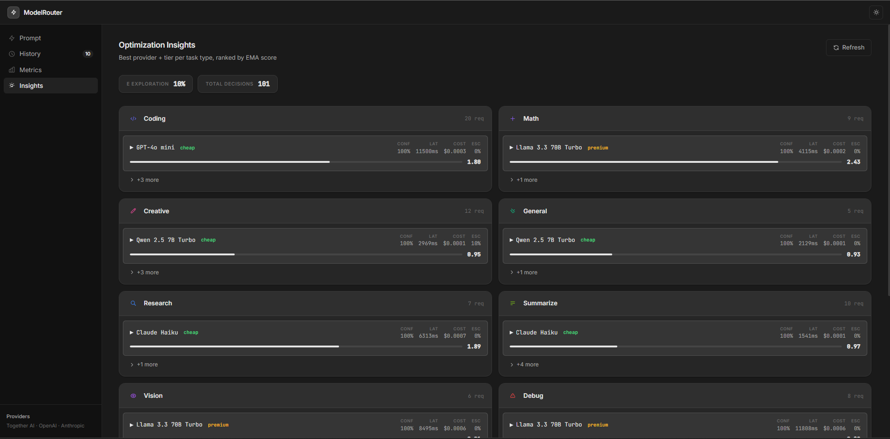

# ModelBandit

A service that reads an LLM prompt, works out what kind of task it is, and sends
it to the cheapest model that should be able to handle it. It keeps score of how
every model does on every kind of task and uses that to make the next decision.

I built it because I kept paying GPT-4o prices for prompts like "what's the
capital of Peru". Most prompts don't need the best model, but you can't tell
which ones do without looking at them first - so this looks at them first.

The name is from the multi-armed bandit problem: every model is an arm, every
request is a pull, and the router balances exploiting the arm that's paid off
best so far against exploring the others. That's the epsilon-greedy part below.

## Try it

**[modelbandit.up.railway.app](https://modelbandit.up.railway.app/)** is the
full app: sign up, send a prompt, and it classifies it, picks a model, calls
it through OpenRouter, and shows you the decision next to the answer. It's
running on a free Railway instance and the cheap models take a few seconds.

**[mohidf.github.io/ModelBandit](https://mohidf.github.io/ModelBandit/)** is
the browser demo, for when you just want to see the decision logic.

Type a prompt and it shows what the router would do with it: which task type
the regexes voted for and why, how confident that vote was, and which model
wins the scoring and by how much. It's the server's actual classifier and
scoring code from [`backend/src`](backend/src) bundled with Vite, running
against a snapshot of my performance table. No server, no keys.

Two things it can't do: ambiguous prompts on the real server go on to an
embedding step that needs an OpenAI key, and it doesn't call a model, so
you get the decision but not the answer. The full app does both.

Each request goes through four steps:

1. **Classify** - what kind of task is this, how hard is it, and how sure are we
2. **Choose** - score every model that has history on this task type, pick the best
3. **Run** - call the provider, and if the classifier wasn't confident, retry one tier up
4. **Learn** - fold the result into that model's running averages for next time

The backend is Node and TypeScript on Express, with Postgres (on Neon, through
Drizzle) for the performance history and Better Auth for accounts. The frontend
is React. Every model is called through OpenRouter - the open-weight ones and
GPT-4o and Claude alike - so there is one provider class and one key.

## Running it

You need Node 18+, a Postgres database, and at least one provider key. I use
a free [Neon](https://neon.tech) project; a local Postgres works the same.

```bash
git clone https://github.com/mohidf/ModelBandit.git
cd ModelBandit
npm run install:all

cp backend/.env.example backend/.env   # DATABASE_URL, BETTER_AUTH_SECRET, provider keys
cd backend && npm run db:migrate       # creates the tables and the EMA function
```

Then:

```bash
npm run backend:dev    # http://localhost:3000
npm run frontend:dev   # http://localhost:5173, proxies /api to the backend
```

Sign up in the browser and send a prompt. A user with no saved key routes on
the server's OpenRouter key, so on your own machine you don't need to paste
anything. A key saved on the settings page takes precedence.

The keys that matter:

| variable | what it's for |
|---|---|
| `DATABASE_URL` | required - a Postgres connection string |
| `BETTER_AUTH_SECRET` | required - random string that signs session cookies |
| `OPENROUTER_API_KEY` | every model call: Llama, Qwen, DeepSeek, GPT-4o and Claude through one key |
| `OPENAI_API_KEY` | optional, only the classifier's embedding step |
| `CONFIDENCE_THRESHOLD` | below this classifier confidence, escalate (default `0.20`) |

Users can save their own OpenRouter key from the settings page. When they do,
it is used instead of the server's.

Accounts are email and password through Better Auth, which stores its users and
sessions in the same database. Sessions are cookies, so the frontend never
handles a token.

### Hosting it

One Docker image runs the whole thing: the backend serves the built frontend
from the same origin, so sessions are plain first-party cookies.

```bash
docker build -t modelbandit .
docker run -p 3000:3000 --env-file backend/.env modelbandit
```

`railway.json` points Railway at that Dockerfile; that's what serves
modelbandit.up.railway.app. On any host, set the same
variables as `backend/.env`, plus `BETTER_AUTH_URL` and `ALLOWED_ORIGIN` to the
public URL (for example `https://modelbandit.up.railway.app`), and run
`npm run db:migrate` once against the database. The GitHub Pages site is
only the browser demo; it never talks to this server.

## How it decides

### Classifying the prompt

There are eleven task types: code, debugging, math, math reasoning, creative
writing, research, summarization, vision, chat, multilingual, and general.

Classification is two stages. The first is a pile of weighted regexes - code
fences, language names, "traceback", "summarize", "write a poem", that kind of
thing. Each match adds points to a task type. If at least 80% of the points land
on one type, that's the answer and we're done in well under a millisecond.

If it's less clear than that, the prompt gets embedded with
`text-embedding-3-small` and compared against about 120 example prompts (10 to
12 per task type) that were embedded once at startup. The type whose *closest*
example is nearest wins. I originally averaged similarity across each type's
examples, but that punished types whose examples are diverse - a prompt that
exactly matches one example would lose to a type with twelve vaguely similar
ones. Taking the max fixed it.

Confidence is `(best - second best) / best`. So it's not "how well did the
winner match", it's "how much better was it than the runner-up". A prompt that
matches code at 0.9 and debugging at 0.85 is genuinely ambiguous and gets a low
number, even though 0.9 sounds high.

Complexity (low, medium, high) comes from the rule-based stage regardless -
it's mostly word count and structural signals, and an embedding doesn't know
anything about that.

If the embedding call fails for any reason, the rule-based answer is used and
the request goes through anyway. Classification infrastructure is never allowed
to block a request.

### Choosing a model

Every model has a row per task type in Postgres holding running averages of its
confidence, latency, cost, and how often it needed escalating. For the task type
at hand, each model gets scored:

```
score = w_conf · confidence
      − w_cost · (cost / $0.20)
      − w_lat  · (latency / 30 s)
      − w_esc  · escalation rate
```

Cost and latency are divided by a ceiling so everything is in the range 0 to 1
before the weights touch it. Before I did that the weights meant nothing - a
latency of 2000 (ms) swamped a cost of 0.0003 (dollars) no matter what you
multiplied them by.

The weights differ per task type. Summarization and chat weight cost heavily
because nearly any model can do them; debugging and math reasoning weight
confidence heavily because a wrong answer costs the user more than the tokens
did. The user can also shift them per request - "cheapest that works" or
"best answer" in the UI - which overrides a few of the weights.

Highest score wins. Ties are broken by cost and then latency, so the database's
row order never decides anything.

10% of the time the router ignores all of this and picks a model at random from
the tiers that make sense for the complexity. Without that it would find one
good model per task type and never learn whether a cheaper one could do the job.

If there's no history for a task type yet, it falls back to a static table:
each task type has a cheap, mid and premium model, and the complexity picks
which. Most start on Llama 8B, Llama 70B and DeepSeek; research starts on
Claude; vision on models that accept images.

### Escalating

If classifier confidence came in below the threshold, the request runs again on
the task type's next tier up, or on its `escalateTo` model (GPT-4o for most)
if it was already at premium. Both calls are recorded and both are counted in
the cost shown to the user.

Escalation is about a weak answer. A call that fails outright - a timeout, a
malformed response, a model that's been withdrawn - is handled separately: the
request goes once to a different model at the same tier, and the model that
failed is recorded with zero confidence so the scorer steers away from it
until it recovers. I added this after an account ran out of credit mid-run
and every research prompt turned into a 500.

The important detail is what gets recorded. The first call is marked as having
escalated, which raises that model's escalation rate. Early on I weighted
escalation rate heavily in the score, and the router quickly stopped using cheap
models for chat and creative prompts. But those escalations weren't the cheap
model's fault - they happened because the *classifier* wasn't sure, before the
model was ever called. The escalation weight for those task types is now 0.2,
low enough that it doesn't matter much.

### Learning

After every call the model's row is updated with an exponential moving average
(alpha 0.2) of each metric. That's done in a Postgres function (one `INSERT ...
ON CONFLICT` statement) so two concurrent requests for the same model can't race
each other. Alpha 0.2 means the last
five or so calls dominate, which is enough to react when a provider has a slow
day and stable enough not to flip-flop on one outlier.

## The interface

The prompt page shows the answer, and above it, a plain-English line saying
what the router did: what it classified the prompt as, how confident it was,
which model it sent it to and why. Below is a table of every model it
considered with their averages and scores, so you can see why the winner won.



**Performance** shows what the router currently believes about every model for
every task type - the same tables it uses to decide. **Metrics** is request
totals since the backend last started. **History** is your last 20 requests.



## API

`POST /route`, with the session cookie from signing in:

```json
{ "prompt": "Explain binary search trees", "maxTokens": 1024, "optimizationMode": "balanced" }
```

`optimizationMode` is `cost`, `balanced`, or `quality`. The response carries the
answer plus everything that went into the decision:

```json
{
  "response": "...",
  "classification": { "domain": "coding", "complexity": "low", "confidence": 0.94, "estimatedTokens": 12 },
  "initialModel":   { "provider": "openrouter", "model": "meta-llama/llama-3.1-8b-instruct", "tier": "cheap", "reason": "..." },
  "finalModel":     { "provider": "openrouter", "model": "meta-llama/llama-3.1-8b-instruct", "tier": "cheap", "reason": "..." },
  "escalated": false,
  "strategyMode": "exploitation",
  "latencyMs": 1842,
  "totalCostUsd": 0.0000731,
  "evaluatedOptions": [ { "modelId": "...", "score": 2.91, "averageConfidence": 1.0, "averageLatencyMs": 1842, "averageCostUsd": 0.0000731, "escalationRate": 0.0, "totalRequests": 14 } ]
}
```

`GET /performance` returns the per-task-type rankings, `GET /metrics` the
in-memory totals, and `/history` and `/keys` (GET, POST, DELETE) manage the
signed-in user's data. `/route` is rate limited to 50 requests an hour per IP,
the rest to 200.

## Tests

```bash
cd backend && npm test
```

155 tests. The classifier ones are mostly prompts I got wrong at some point
pinned so they stay right: "create a bar chart with D3" is code, not vision;
"explain how hash maps work" is general, not code; "in the history of
computing" is not research.

`npm run export:snapshot` copies the live performance table into the browser
demo so it ranks models with current numbers.

There's also `npm run benchmark`, which sends 50 labelled prompts through a
running backend and reports classification accuracy split by whether the prompt
has obvious keywords or not, what it cost against sending everything to GPT-4o,
and latency percentiles. It needs real keys and takes a few minutes.

## How the code is laid out

```
backend/src/
  index.ts                     Express app, rate limiters, startup warm-up, serves frontend/dist in production
  config.ts                    every env var, parsed and validated once
  config/models.ts             the model registry: IDs, tiers, prices, context windows
  config/routing.ts            the static fallback table: task type → cheap/mid/premium model, plus escalateTo
  services/
    classifier.ts              stage 1: weighted regexes
    embeddingClassifier.ts     stage 2: nearest anchor by cosine similarity
    anchors.ts                 the ~120 example prompts
    hybridClassifier.ts        runs stage 1, falls through to stage 2 when unsure
    scoring.ts                 the score formula and per-task weights, pure
    strategyEngine.ts          ranks models with it, adds env overrides and the 10% exploration
    performanceStore.ts        read/write the running averages in Postgres
    historyStore.ts, userKeyService.ts   the user's history and saved provider keys
    router.ts                  the whole pipeline: classify, choose, run, escalate, record
    metrics.ts                 in-memory totals for GET /metrics
  providers/
    baseProvider.ts            the interface a provider implements
    providerManager.ts         resolve, escalate, fallback, dispatch
    openrouterProvider.ts      the one provider: OpenAI-compatible client against OpenRouter
    index.ts                   composition root
  db/schema.ts                 every table, in Drizzle's schema DSL
  lib/auth.ts                  Better Auth config (email + password, cookie sessions)
  middleware/                  auth (session lookup), rate limiter, error handler, logger
  routes/                      route, performance, metrics, history, keys
  scripts/benchmark.ts         the 50-prompt benchmark
  __tests__/                   Jest
backend/drizzle/               SQL migrations generated from the schema, plus the EMA function

frontend/src/
  App.tsx                      shell, routing, the prompt page
  components/                  prompt form, response + decision panel, history, performance, metrics
  pages/                       login, onboarding, settings (API keys)
  utils/labels.ts              plain-English names for task types, tiers, providers

Dockerfile, railway.json       one image for backend + built frontend; Railway config
demo/                          the browser demo, published to GitHub Pages by .github/workflows/pages.yml
  src/main.ts                  imports the classifier, scoring and routing table straight from backend/src
  src/snapshot.json            performance table snapshot (refresh with npm run export:snapshot)

docs/                          longer notes on the routing strategy, learning, and provider abstraction
```

## Things I learned the hard way

- I started with Together AI as the open-weight provider. First their plain
  model IDs returned HTTP 400 because only the `-Turbo` variants are serverless,
  which cost me an evening. Then they withdrew the 7B model the cheap tier
  depended on and every request 500'd. Now the open-weight models go through
  OpenRouter, which routes each model ID to whichever host is up, so a single
  vendor dropping a model isn't my problem any more.
- Mapping "high complexity" straight to the premium tier meant the first request
  for every task type seeded the database with premium-only data, and from then
  on the router exploited premium forever because nothing else had a score. High
  complexity now starts at the middle tier and relies on escalation to go
  higher, so cheaper models get a chance to earn a row.
- When I removed a model from the registry, requests for task types that had
  history for it started returning 500 - the strategy engine picked it as the
  winner and then couldn't resolve it. It now skips stale rows and tries the
  next best.
- A per-IP rate limiter that never deletes entries is a slow memory leak. And
  behind a proxy, without `trust proxy`, every request has the same IP and
  everyone shares one bucket.
- A regex for research that matched "history of" was routing "the history of
  computing" to Claude Opus. Anything that broad needs to be much more
  specific, or gone.
- GPT-OSS 20B looked great on paper, cheapest and fastest, and then returned
  an empty answer to a code prompt because it spent the whole token budget on
  hidden reasoning. Not every cheap model is a bargain.
- Metrics in different units can't share a weighted sum. Normalise first.
- The classifier's confidence should measure the margin, not the match.
